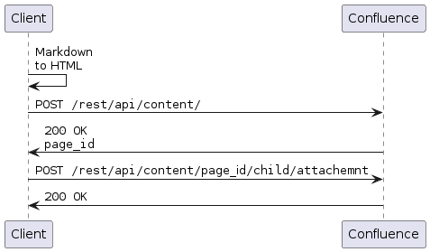

# Creating a Page

Short desc

## Before you start

## Overview

@startuml
Client -> Client: Markdown\nto HTML
Client -> Confluence: ""POST /rest/api/content/""
Confluence -> Client: ""200 OK""\n""page_id""
Client -> Confluence: ""POST /rest/api/content/""page_id""/child/attachemnt""
Confluence -> Client: ""200 OK""
@enduml