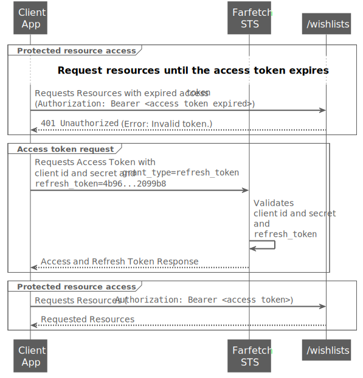

<!--title:start-->
# Exchanging a Refresh Token for an Access Token
<!--title:end-->
<!--shortdesc:start-->

Exchange a refresh token for an access token and avoid asking the user to authenticate again.

<!--shortdesc:end-->

<!--desc:start-->
## Overview

After a successful execution of the implemented authorization flow, Farfetch Security Token Service (STS) provides an access token to the client application. With the access token, the client app can access the protected resources until it expires. 

If the client app has implemented the authorization code flow ([with](authorization-code-with-pkce.md) or [without](authorization-code.md) PKCE), Farfetch STS may also provide a refresh token. With the refresh token, the client app can request a new access token without re-executing the authorization flow.

> If the client app has implemented the [implicit flow](implicit.md), Farfetch STS **doesn't** provide refresh tokens to the client application.

Access with refresh token involves the following participants:

| Participant |   |
|-------------- |--------------- |
| Client Application | The application that the customer is using. |
| Farfetch STS |Security Token Service (STS). It represents the authentication server. |
| /wishlist | Protected resource in the resource server. |

To request a refresh token, you **must** include scope `offline_access` in the `/connect/authorize` request. The following sequence diagram shows the process of requesting a new access token with a refresh token:



The client app verifies if the `access_token` has expired. Either the client app decoded the `access_token` and verified the timestamp in property `exp` or the client app made a request to the resource server and the resource server sent a `401 Unauthorized` response.

## Steps

### 1. Exchange a refresh token for an access token 
If the `access_token` is no longer valid, the client app can send a request to the [/connect/token](../authentication-api/token.md) endpoint as follows:

```shell
curl --request POST \
  --url https://auth.farfetch.net/connect/token \
  --header 'accept: application/json' \
  --header 'content-type: application/x-www-form-urlencoded' \
  --data 'client_id=ff_amazing_client' \
  --data 'client_secret=amazing_client_secret' \
  --data 'grant_type=refresh_token' \
  --data 'refresh_token=4b96...2099b8'
```

* `client_id` and `client_secret` contain the client app credentials.
* `grant_type` **must** have the value `refresh_token`.
* `refresh_token` **must** contain the refresh token that Farfetch STS provided in the previous `access_token` request.

If Farfetch STS can validate the client credentials and the `refresh_token`, it sends a `200 OK` with the new `access_token` and a new `refresh_token` as follows:

```json
HTTP/1.1 200 OK
Content-Type: application/json
Cache-Control: no-store
Pragma: no-cache

{
  "access_token": "AYjcyMz...Y3ZDhiNmJkNTY",
  "refresh_token": "RjY2Nj...M5NzA2OWJjuE7c",
  "token_type": "bearer",
  "expires_in": 2400
}
```

With the new `access_token`, the client app can make new requests to Farfetch resource server.
If Farfetch STS doesn't return the same `refresh_token`, it means that it remains valid.

> Refresh tokens also have an expiration date. You need to decode the `refresh_token` to view the expiration date of the `refresh_token`. 
<!--desc:end-->