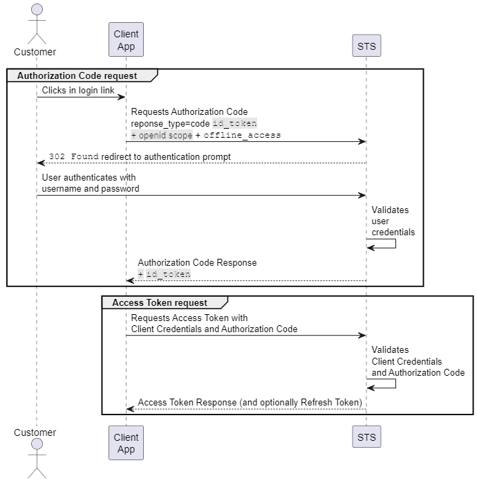

<!--title:start-->
# Authorization Code
<!--title:end-->
<!--shortdesc:start-->
Authenticate a client application and a user with authorization code flow.
<!--shortdesc:end-->

<!--desc:start-->

## Before you start

This tutorial requires:

* A Client Application configured with access type `Authorization Code`.

## Overview

This flow is named "Authorization Code", because the client application obtains the Access Token using an authorization code previously issued by the STS.

[OAuth 2.0](https://tools.ietf.org/html/rfc6749) specifications define the Authorization Code Flow (ACF) and OpenID Connect extends it.

ACF is optimized for web applications and involves the following participants:

| Participants | |
|------------- |------- |
| Customer | User and the user-agent.  |
| Client Application | Application requesting authorization. |
| STS | Security Token Service (STS). |

The following sequence diagram shows the ACF:



For simplicity, sequence diagrams only show messages for the use case where both the customer and the client application are valid. Other cases are explained in each section.

The ACF starts with the customer accessing the client application and clicking a login link.

## Steps

### 1. Authorization code request

The client application sends a request using `/connect/authorize` to the  STS as follows:

```http
GET https://<authorization-servcer-url>/connect/authorize
  ?response_type=code id_token
  &client_id=happy_client
  &redirect_uri=https://happyclientapp/callback-success
  &scope=openid+offline_access
  &nonce=12345
  &state=abcde
```

* `response_type=code id_token` indicates the type of response that the client application is expecting:
    * `code` indicates that the client application expects an authorization code.
    * `id_token` indicates that the client application expects an id token.
* `client_id` is the client application id.
* `redirect_uri` is one of the redirect URI of the  the client application.
* `scope=openid+offline_access+` indicates the scopes that the client application is requesting.
  * `openid` indicates that the client application is requesting the claim `sub` in the access token and the claims `iss`, `aud`, `iat`, and `exp` in the id token.
  * `offline_access` indicates that the client application is requesting a refresh token.
* `nonce` is an arbitrary number and a timestamp that can be used just once.
* `state` is an arbitrary value that  STS returns in the `redirect_uri` to prevent Cross-Site Request Forgery. 

After receiving the `/connect/authorize/` request, the STS sends a `302 Found` and directs the customer to a prompt where it asks the customer to login. If it recognizes the customer, it redirects the customer to the `redirect_uri` in the `GET /connect/authorize` response. For example:

```http
https://happyclientapp/callback-success
    ?code=hdh922
    &id_token=IYsjdhYsdldnnHHHn,ksnajJHkJkk
    &state=abcde
    &nonce=12345
```

* `code` is the authorization code that allows the client application to request the access token.
* `id_token` allows the client application to verify the customer.

The client application uses the `state` and `nonce` to validate the callback. If the client application cannot validate these parameters, the flow **must** end.

If the  STS doesn't recognize the customer, it sends a `403 Forbidden` to the client application and the flow **must** end. 

### 2. Access token request

The client application sends a request using `/connect/token` to the  STS as follows:  

```shell
curl --request POST \
  --url https://<authorization-servcer-url>/connect/token \
  --header 'accept: application/json' \
  --header 'content-type: application/x-www-form-urlencoded' \
  --data 'client_id=happy_client' \
  --data 'client_secret=happy_client_secret' \
  --data 'grant_type=authorization_code' \
  --data 'code=hdh922' \
  --data 'redirect_uri=https://happyclientapp.net/callback-success'
```

* `client_id` and `client_secret` are the client application credentials.
* `grant_type=authorization_code` indicates the type of flow the client application is using.
* `code` is the authorization code that the client application received in the `redirect_uri`
* `redirect_uri` **must** be the same as the one used in the `GET /connect/authorize` request. 

After receiving, the `/connect/token` request,  STS proceeds as follows:

1.  STS validates the client credentials. 
    * If the client credentials are valid,  STS verifies the authorization code. 
    * Otherwise, it ends the flow with a `403 Forbidden`.
2.  STS verifies the authorization code.
    * If the authorization code is valid, it generates the access and id tokens and sends a `200 OK` to the client application with the access and id tokens.
    * Otherwise, it ends the flow with a `400 Bad Request`.

```json
HTTP/1.1 200 OK
Content-Type: application/json
Cache-Control: no-store
Pragma: no-cache

{
  "access_token": "AYjcyMzY3ZDhiNmJkNTY",
  "refresh_token": "RjY2NjM5NzA2OWJjuE7c",
  "token_type": "bearer",
  "expires_in": 2400
}
```

* `access_token` and `token_type` allow the client application to access protected resources.
* `refresh_token` allows the client application to request another `access_token` without asking the customer to login.

## Result

With the access token and the token type, the client application can now access protected resources.

<!--desc:end-->
