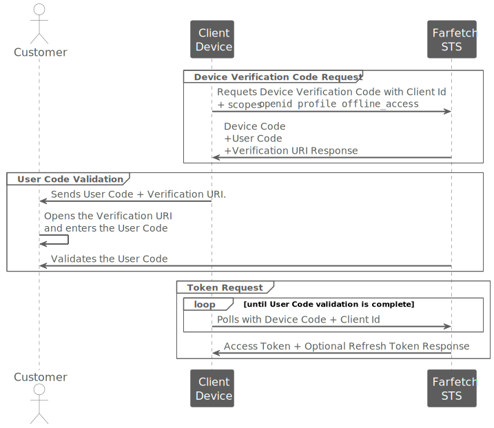

<!--title:start-->
# Device Authorization Flow
<!--title:end-->
<!--shortdesc:start-->
Request an access token for a device.
<!--shortdesc:end-->
<!--desc:start-->
## Before you start

This tutorial requires:
* A Client Device configured with access type `Device Flow`.

## Overview

This flow is named "Device Authorization", because the client is a smart device with limited input capabilities or without a suitable browser. For example, a Smart TV or picture frames. The [Device Authorization flow](https://datatracker.ietf.org/doc/html/rfc8628) allows the customer to use a secondary device like a mobile phone or a computer to review the authorization request.

The Device Authorization flow involves the following participants:

| Participants | |
|------------- |------- |
| Customer | Customer is the end user at a browser that is trying to authenticate in a smart device. For example, a Smart TV.  |
| Client Device | The client device is the device that the customer uses to authenticate in the Farfetch Platform. For example, a Smart TV.  |
| Farfetch STS | Farfetch Security Token Service (STS) is the authentication server. |

The following sequence diagram shows the Device Authorization flow:



## Steps

### 1. Request the device verification code

The client device sends a request using [/connect/deviceauthorization](../authentication-api/deviceauthorization.md) to the Farfetch STS as follows:

```bash
curl --request POST \
  --url https://auth.farfetch.net/connect/deviceauthorization \
  --data-urlencode 'client_id=ff_smart_client' \
  --data-urlencode 'client_secret=ff_smart_client_secret' \
  --data-urlencode 'scope=openid+profile+offline_access'
```

* `client_id` is the id that Farfetch issued for the client device when it was registered.
* `client_secret` is the secret of the client device. If the client device configuration requires, add the client secret.
* `scope=openid+profile+offline_access` indicates the scopes that the client device is requesting.
    * `openid` indicates that the client device is requesting the claim `sub` in the [access token](../authentication-api/access-token.md) and the claims `iss`, `aud`, `iat`, and `exp` in the [id token](../authentication-api/id-token.md)
    * `profile` indicates that the client device is requesting to use the customer name.
    * `offline_access` indicates that the client device is requesting a refresh token.

After receiving, [/connect/deviceauthorization](../authentication-api/deviceauthorization.md) request, Farfetch STS sends the following answer:

```json
HTTP/1.1 200 OK
Content-Type: application/json
Cache-Control: no-store
Pragma: no-cache

{
    "device_code": "021cdf83-96b7-4f4f-b062-acc23861a0c8",
    "user_code": "QWERTYUI",
    "verification_uri": "https://farfetch.com/activate",
    "verification_uri_complete": "https://farfetch.com/activate?user_code=QWERTYUI",
    "expires_in": 200,
    "interval": 5
}
```

* `device_code` allows the verification of the client device.
* `user_code` allows the customer to complete authentication in the secondary device.
* `verification_uri` is the URL where the customer must enter the `user_code`.
* `verification_uri_complete` is the URL that the client device uses to generate a QR Code that the customer can scan.
* `expires_in` are the number of seconds that the `device_code` and the `user_code` are valid. After the `device_code` and the `user_code` expire, the customer has to start the process again.
* `interval` are the number of seconds that the client device **should** wait between polls.

After receiving the `device_code` in the [/connect/deviceauthorization](../authentication-api/deviceauthorization.md) response, the client device starts polling Farfetch STS with the `client_id` and the `device_code`. The client device stops polling when the customer completes the authentication with the `user_code`.

### 2. Show user code to customer

To allow the customer to finish authentication, the client device **must** show the customer one of the following:

* The QR code with the `verification_uri_complete`. 
* The `user_code` and the `verification_uri`.

The customer **must** do one of the following:

<ul>  
<li>With a mobile phone:
    <ol>
      <li>Scans the QR code.</li>
      <li>Opens the `verification_uri_complete`.</li>
      <li>Finishes authentication.</li>
    </ol>
  </li>
<li>With a secondary device:
    <ol>
      <li>Manually opens the `verification_uri`.</li>
      <li>Authenticates in the site.</li>
      <li>Enters the `user_code`.</li>
      <li>Validates the requested scopes.</li>
      <li>Finishes authentication.</li>
    </ol> 
  </li>
</ul>

> Note that you must implement this step in your client device.

### 3. Request the access token

While the customer is authentication, the client device polls Farfetch STS with a [/connect/token](../authentication-api/token.md) token request as follows:

```bash
curl --request POST \
  --url https://auth.farfetch.net/connect/token \
  --header 'Accept: application/json' \
  --header 'Content-Type: application/x-www-form-urlencoded' \
  --data-urlencode 'client_id=ff_device_client' \
  --data-urlencode 'grant_type=urn:ietf:params:oauth:grant-type:device_code' \
  --data-urlencode 'device_code=021cdf83-96b7-4f4f-b062-acc23861a0c8'
```

* `client_id` is the id that Farfetch issued for the client device when it was registered.
* `grant_type=urn:ietf:params:oauth:grant-type:device_code` indicates that the client is a device.
* `device_code` is the code that identifies the device.

After receiving, [/connect/token](../authentication-api/token.md) request, Farfetch STS proceeds as follows:

* If the customer has not completed authentication:

```json
HTTP/1.1 200
Content-Type: application/json
Cache-Control: no-store
Pragma: no-cache

{
  "error": "authorization_pending",
  "error_description": "The device authorization is pending. Please try again later."
}
```

* If the customer has completed authentication:

```json
HTTP/1.1 200 OK
Content-Type: application/json
Cache-Control: no-store
Pragma: no-cache

{
  "token_type": "Bearer",
  "expires_in": 3600,
  "access_token": "eyJraWQ...JQuDJh8g",
  "scope": "openid profile offline_access",
  "refresh_token": "zcLdr1FBXwtI9ej98VVVwtjDd-SmaoL06qr_UcY2tNA",
  "id_token": "eyJraWQ...WI6KR0aQ"
}
```

<!--desc:end-->
