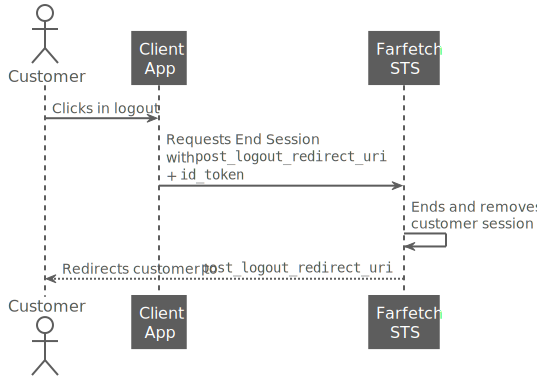

<!--title:start-->
# Logout
<!--title:end-->
<!--shortdesc:start-->

At any time the customer may need to logout from the session in the client application. The logout process involves the following participants:
<!--shortdesc:end-->
<!--desc:start-->

| Participants |  |
|----- |----------------- |
| Customer | User or resource owner.  |
| Client Application | The client application can be a website, a single page application, a mobile application, etc. |

The following sequence diagram shows the logout process:


<!--overview:end-->

<!--steps:start-->
## Steps

### 1. Logout from all client apps with open sessions

If the customer is logged in multiple client apps with a  account, the customer may want to logout from all the applications. For example, the customer has several open sessions in the web browser using the  account.

The logout process involves the following participants:

| Participants |  |
|----- |----------------- |
| Customer | User or resource owner.  |
| Client Application | The client application can be a website, a single page application, a mobile application, etc. |
|  STS | Security Token Service (STS). It represents the authentication server. |



The customer clicks logout and the client application sends a [/connect/endsession](../authentication-api/end-session.md) to  as follows:

```http
https://auth..net/connect/endsession
    ?post_logout_redirect_uri=https://amazingclientapp/callback-logout
    &id_token_hint=IYsjdhYsdldnnHHHn,ksnajJHkJkk
```

* `post_logout_redirect_uri`  contains the URI where  redirects the customer after logout. The redirect URI must match one of post logout redirect URIs that the client application registered at .
* `id_token_hint`  **must** contain the `id_token`. If the `/connect/endsession` request includes this parameter,  STS doesn't ask the customer for a logout confirmation.
* The form-encoding was removed and the line breaks added for readability. 
<!--desc:end-->


