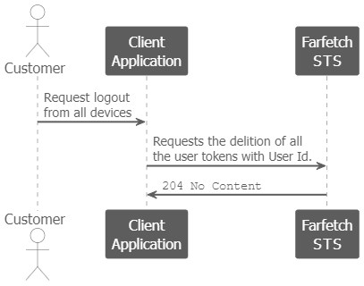

<!--title:start-->
# Single Logout
<!--title:end-->
<!--shortdesc:start-->
Logout the user from all devices.
<!--shortdesc:end-->
<!--desc:start-->

## Before you start

The tutorial requires: 

* A token requested by a front office client application for a registered user with one of the following scope sets:
    - `id.users.tokens` for public requests.
    - `int.id.tokens` and `int.id.tokens.delete` for internal requests. 

## Overview

The following sequence diagram shows the single logout:



To give context, the sequence diagram also shows interactions between the Customer and the Client Application.

## Steps

### 1. Delete all tokens

The Client Application requests the token deletion as follows: 

```shell
curl --request DELETE \
   --url 'https://auth.farfetch.net/v1/iga/mgt/users/5000012275166449/tokens' \
   --header 'authorization: Bearer eyJhbG...GEL9FztzY' 
```

After receiving the `/users/5000012275166449/tokens` request, Farfetch  STS deletes all the tokens associated with user `5000012275166449`.

```json
...
"sub": "5000012275166449",
...
```

After completing deletion, Farfetch STS sends a `204 No content` to the Client Application.

```shell
HTTP/1.1 204 No content
```

> 
> Note that the Client Application should delete the cookies. 
>

## Result

The next time the customer accesses Farfetch Platform, the customer will have to perform authentication.

>
> TIP: While persisting  user sessions, the Client Application can introspect tokens from time to time.
>

<!--desc:end-->
